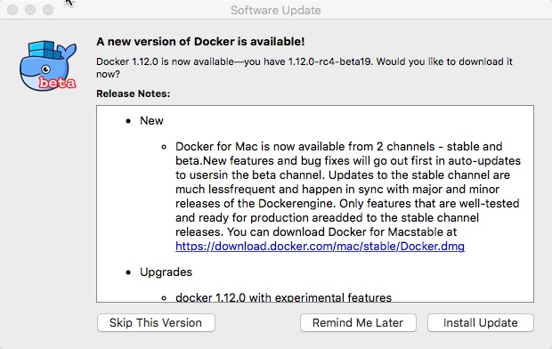

## 演示环境介绍

演示用的笔记本：2011款MacBook Pro， 8GB内存，256GB SSD硬盘。

软件版本：

最新版Docker for Mac (beta)


VirtualBox 最新版: Version 5.0.26 r108824


## 创建三个节点

```
docker-machine create node1 --driver virtualbox \
--engine-insecure-registry 192.168.99.1:5000  \
--virtualbox-cpu-count "1"  \
--virtualbox-disk-size "80000"  \
--virtualbox-memory "512" \
--virtualbox-boot2docker-url=/Users/martin/Downloads//boot2docker_1.12.0.iso

docker-machine create node2 --driver virtualbox \
--engine-insecure-registry 192.168.99.1:5000  \
--virtualbox-cpu-count "1"  \
--virtualbox-disk-size "80000"  \
--virtualbox-memory "512" \
--virtualbox-boot2docker-url=/Users/martin/Downloads//boot2docker_1.12.0.iso

docker-machine create node3 --driver virtualbox \
--engine-insecure-registry 192.168.99.1:5000  \
--virtualbox-cpu-count "1"  \
--virtualbox-disk-size "80000"  \
--virtualbox-memory "512" \
--virtualbox-boot2docker-url=/Users/martin/Downloads//boot2docker_1.12.0.iso

```

节点创建结果查看：

```
martin@localhost:~/Documents% docker-machine ls
NAME    ACTIVE   DRIVER       STATE     URL                         SWARM   DOCKER    ERRORS
node1   -        virtualbox   Running   tcp://192.168.99.100:2376           v1.12.0
node2   -        virtualbox   Running   tcp://192.168.99.101:2376           v1.12.0
node3   -        virtualbox   Running   tcp://192.168.99.102:2376           v1.12.0
```


## docker 版本信息查看

进入节点node1查看docker版本信息
```
martin@localhost:~/Documents% docker-machine ssh node1
                        ##         .
                  ## ## ##        ==
               ## ## ## ## ##    ===
           /"""""""""""""""""\___/ ===
      ~~~ {~~ ~~~~ ~~~ ~~~~ ~~~ ~ /  ===- ~~~
           \______ o           __/
             \    \         __/
              \____\_______/
 _                 _   ____     _            _
| |__   ___   ___ | |_|___ \ __| | ___   ___| | _____ _ __
| '_ \ / _ \ / _ \| __| __) / _` |/ _ \ / __| |/ / _ \ '__|
| |_) | (_) | (_) | |_ / __/ (_| | (_) | (__|   <  __/ |
|_.__/ \___/ \___/ \__|_____\__,_|\___/ \___|_|\_\___|_|
Boot2Docker version 1.12.0, build HEAD : e030bab - Fri Jul 29 00:29:14 UTC 2016
Docker version 1.12.0, build 8eab29e
docker@node1:~$

docker@node1:~$ docker info
Containers: 0
 Running: 0
 Paused: 0
 Stopped: 0
Images: 0
Server Version: 1.12.0
Storage Driver: aufs
 Root Dir: /mnt/sda1/var/lib/docker/aufs
 Backing Filesystem: extfs
 Dirs: 0
 Dirperm1 Supported: true
Logging Driver: json-file
Cgroup Driver: cgroupfs
Plugins:
 Volume: local
 Network: host bridge overlay null
Swarm: inactive
Runtimes: runc
Default Runtime: runc
Security Options: seccomp
Kernel Version: 4.4.16-boot2docker
Operating System: Boot2Docker 1.12.0 (TCL 7.2); HEAD : e030bab - Fri Jul 29 00:29:14 UTC 2016
OSType: linux
Architecture: x86_64
CPUs: 1
Total Memory: 492.6 MiB
Name: node1
ID: 6A5K:WORD:JYZU:V4L2:DF7I:ACPV:LJFA:HFJH:5MOQ:S2QM:YHPT:6LQZ
Docker Root Dir: /mnt/sda1/var/lib/docker
Debug Mode (client): false
Debug Mode (server): true
 File Descriptors: 13
 Goroutines: 23
 System Time: 2016-07-30T15:15:13.049600502Z
 EventsListeners: 0
Registry: https://index.docker.io/v1/
Labels:
 provider=virtualbox
Insecure Registries:
 192.168.99.1:5000
 127.0.0.0/8
docker@node1:~$
```


## docker swarm 初始化

在节点node1上初始化Swarm mode群集，查看manager节点IP地址

```
docker@node1:~$ ip add s   
1: lo: <LOOPBACK,UP,LOWER_UP> mtu 65536 qdisc noqueue state UNKNOWN group default qlen 1
    link/loopback 00:00:00:00:00:00 brd 00:00:00:00:00:00
    inet 127.0.0.1/8 scope host lo
       valid_lft forever preferred_lft forever
    inet6 ::1/128 scope host
       valid_lft forever preferred_lft forever
2: dummy0: <BROADCAST,NOARP> mtu 1500 qdisc noop state DOWN group default qlen 1000
    link/ether a6:92:eb:4c:cb:ff brd ff:ff:ff:ff:ff:ff
3: eth0: <BROADCAST,MULTICAST,UP,LOWER_UP> mtu 1500 qdisc pfifo_fast state UP group default qlen 1000
    link/ether 08:00:27:f3:d1:90 brd ff:ff:ff:ff:ff:ff
    inet 10.0.2.15/24 brd 10.0.2.255 scope global eth0
       valid_lft forever preferred_lft forever
    inet6 fe80::a00:27ff:fef3:d190/64 scope link
       valid_lft forever preferred_lft forever
4: eth1: <BROADCAST,MULTICAST,UP,LOWER_UP> mtu 1500 qdisc pfifo_fast state UP group default qlen 1000
    link/ether 08:00:27:ff:b4:45 brd ff:ff:ff:ff:ff:ff
    inet 192.168.99.100/24 brd 192.168.99.255 scope global eth1
       valid_lft forever preferred_lft forever
    inet6 fe80::a00:27ff:feff:b445/64 scope link
       valid_lft forever preferred_lft forever
6: docker0: <NO-CARRIER,BROADCAST,MULTICAST,UP> mtu 1500 qdisc noqueue state DOWN group default
    link/ether 02:42:1c:85:ef:33 brd ff:ff:ff:ff:ff:ff
    inet 172.17.0.1/16 scope global docker0
       valid_lft forever preferred_lft forever
docker@node1:~$
```

使用docker swarm init 命令初始化node1为管理节点。请根据你的IP地址调整这条命令。
```
docker@node1:~$ docker swarm init --advertise-addr 192.168.99.100
Swarm initialized: current node (7fkc9gml325pekzmemtfflp6s) is now a manager.

To add a worker to this swarm, run the following command:
    docker swarm join \
    --token SWMTKN-1-3p6af6uy6aqlghj1zb1lwx8dw20kxcivdnwdjy4qmvsttc4jmf-7bimj049k2w5qqlqnkp1s1nq3 \
    192.168.99.100:2377

To add a manager to this swarm, run the following command:
    docker swarm join \
    --token SWMTKN-1-3p6af6uy6aqlghj1zb1lwx8dw20kxcivdnwdjy4qmvsttc4jmf-4ybuxkzczpsmysmj7p8rq64ln \
    192.168.99.100:2377
docker@node1:~$
```
返回结果是两条命令，一条用于添加manager节点，一条用于添加worker节点。


## docker swarm 群集查看

查看刚刚初始化好的swarm群集
```
docker@node1:~$ docker node ls
ID                           HOSTNAME  STATUS  AVAILABILITY  MANAGER STATUS
7fkc9gml325pekzmemtfflp6s *  node1     Ready   Active        Leader
```


## node2 加入群集

```
martin@localhost:~/Documents% docker-machine ssh node2
                        ##         .
                  ## ## ##        ==
               ## ## ## ## ##    ===
           /"""""""""""""""""\___/ ===
      ~~~ {~~ ~~~~ ~~~ ~~~~ ~~~ ~ /  ===- ~~~
           \______ o           __/
             \    \         __/
              \____\_______/
 _                 _   ____     _            _
| |__   ___   ___ | |_|___ \ __| | ___   ___| | _____ _ __
| '_ \ / _ \ / _ \| __| __) / _` |/ _ \ / __| |/ / _ \ '__|
| |_) | (_) | (_) | |_ / __/ (_| | (_) | (__|   <  __/ |
|_.__/ \___/ \___/ \__|_____\__,_|\___/ \___|_|\_\___|_|
Boot2Docker version 1.12.0, build HEAD : e030bab - Fri Jul 29 00:29:14 UTC 2016
Docker version 1.12.0, build 8eab29e
docker@node2:~$
```

```
docker@node2:~$ docker swarm join \
>     --token SWMTKN-1-3p6af6uy6aqlghj1zb1lwx8dw20kxcivdnwdjy4qmvsttc4jmf-7bimj049k2w5qqlqnkp1s1nq3 \
>     192.168.99.100:2377
This node joined a swarm as a worker.

docker@node2:~$ docker info
Containers: 0
 Running: 0
 Paused: 0
 Stopped: 0
Images: 0
Server Version: 1.12.0
Storage Driver: aufs
 Root Dir: /mnt/sda1/var/lib/docker/aufs
 Backing Filesystem: extfs
 Dirs: 0
 Dirperm1 Supported: true
Logging Driver: json-file
Cgroup Driver: cgroupfs
Plugins:
 Volume: local
 Network: bridge host null overlay
Swarm: active
 NodeID: 7m48wfe2dp08h8tjltcmszp9g
 Is Manager: false
 Node Address: 192.168.99.101
Runtimes: runc
Default Runtime: runc
Security Options: seccomp
Kernel Version: 4.4.16-boot2docker
Operating System: Boot2Docker 1.12.0 (TCL 7.2); HEAD : e030bab - Fri Jul 29 00:29:14 UTC 2016
OSType: linux
Architecture: x86_64
CPUs: 1
Total Memory: 492.6 MiB
Name: node2
ID: PCAN:JNVV:RCCV:CBQR:PSUP:XUMA:7TFE:AFBT:BPX7:O4OQ:4FWZ:FPW3
Docker Root Dir: /mnt/sda1/var/lib/docker
Debug Mode (client): false
Debug Mode (server): true
 File Descriptors: 22
 Goroutines: 67
 System Time: 2016-07-30T15:22:46.429809048Z
 EventsListeners: 0
Registry: https://index.docker.io/v1/
Labels:
 provider=virtualbox
Insecure Registries:
 192.168.99.1:5000
 127.0.0.0/8
docker@node2:~$
```


## docker swarm 群集节点查看

docker@node1:~$ docker node ls
ID                           HOSTNAME  STATUS  AVAILABILITY  MANAGER STATUS
7fkc9gml325pekzmemtfflp6s *  node1     Ready   Active        Leader
7m48wfe2dp08h8tjltcmszp9g    node2     Ready   Active
docker@node1:~$


## node3 加入群集

```
martin@localhost:~/Documents% docker-machine ssh node3
                        ##         .
                  ## ## ##        ==
               ## ## ## ## ##    ===
           /"""""""""""""""""\___/ ===
      ~~~ {~~ ~~~~ ~~~ ~~~~ ~~~ ~ /  ===- ~~~
           \______ o           __/
             \    \         __/
              \____\_______/
 _                 _   ____     _            _
| |__   ___   ___ | |_|___ \ __| | ___   ___| | _____ _ __
| '_ \ / _ \ / _ \| __| __) / _` |/ _ \ / __| |/ / _ \ '__|
| |_) | (_) | (_) | |_ / __/ (_| | (_) | (__|   <  __/ |
|_.__/ \___/ \___/ \__|_____\__,_|\___/ \___|_|\_\___|_|
Boot2Docker version 1.12.0, build HEAD : e030bab - Fri Jul 29 00:29:14 UTC 2016
Docker version 1.12.0, build 8eab29e
docker@node3:~$

docker@node3:~$ docker swarm join \
>     --token SWMTKN-1-3p6af6uy6aqlghj1zb1lwx8dw20kxcivdnwdjy4qmvsttc4jmf-7bimj049k2w5qqlqnkp1s1n
q3 \
>     192.168.99.100:2377
This node joined a swarm as a worker.
docker@node3:~$

```

## docker swarm 群集节点查看

```
docker@node1:~$ docker node ls
ID                           HOSTNAME  STATUS  AVAILABILITY  MANAGER STATUS
7fkc9gml325pekzmemtfflp6s *  node1     Ready   Active        Leader
7m48wfe2dp08h8tjltcmszp9g    node2     Ready   Active
9enczapw848f0m7r69eaynqtw    node3     Ready   Active
docker@node1:~$
```
两位两个节点以worker的身份加入了群集。

## 测试swarm群集服务创建

创建测试服务ping00，使用alpine镜像，ping 192.168.99.1 主机地址。
```
docker@node1:~$ docker service create --name ping00 192.168.99.1:5000/alpine ping 192.168.99.104
9aehwynxb3am31l5oiy22kwwl

docker@node1:~$ docker service ls
ID            NAME    REPLICAS  IMAGE                     COMMAND
9aehwynxb3am  ping00  1/1       192.168.99.1:5000/alpine  ping 192.168.99.100

docker@node1:~$ docker service ps ping00
ID                         NAME      IMAGE                     NODE   DESIRED STATE  CURRENT STATE               ERROR
5jww56qpe077j9uz79rb742vm  ping00.1  192.168.99.1:5000/alpine  node1  Running        Running about a minute ago
docker@node1:~$

docker@node1:~$ docker ps
CONTAINER ID        IMAGE                             COMMAND                 CREATED             STATUS              PORTS               NAMES
a1b5e6c3592e        192.168.99.1:5000/alpine:latest   "ping 192.168.99.100"   13 minutes ago      Up 13 minutes                           ping00.1.5jww56qpe077j9uz79rb742vm
docker@node1:~$ docker logs -f a1
PING 192.168.99.100 (192.168.99.100): 56 data bytes
64 bytes from 192.168.99.100: seq=0 ttl=64 time=0.097 ms
64 bytes from 192.168.99.100: seq=1 ttl=64 time=0.091 ms
64 bytes from 192.168.99.100: seq=2 ttl=64 time=0.101 ms
64 bytes from 192.168.99.100: seq=3 ttl=64 time=0.124 ms

docker@node1:~$ docker exec -it  a1 hostname
a1b5e6c3592e
docker@node1:~$

docker@node1:~$ docker service rm ping00
ping00

docker@node1:~$ docker ps
CONTAINER ID        IMAGE               COMMAND             CREATED             STATUS              PORTS               NAMES

```
以上的测试表明，建立服务正常，容器工作正常，服务删除之后，没有容器在运行了。

## 构建测试web站点镜像

在Mac笔记本上用Docker for Mac做一个网站的demo镜像。

```
martin@localhost:~/Downloads/images/demo-sit% docker build -t localhost:5000/mycooldemo:v1 .
Sending build context to Docker daemon 1.999 MB
Step 1 : FROM localhost:5000/httpd
 ---> bf8f39bc3b6b
Step 2 : COPY ./public-html/ /usr/local/apache2/htdocs/
 ---> 55502f38daf3
Removing intermediate container 2ec1eb05615b
Successfully built 55502f38daf3


martin@localhost:~/Downloads/images/demo-sit% docker images
martin@Martins-MacBook-Pro:~/Downloads/images/docker-swarm-demp% docker images
REPOSITORY                                  TAG                 IMAGE ID            CREATED             SIZE
localhost:5000/mycooldemo                   v1                  bbb741b9f904        2 seconds ago       196.4 MB
gitlab                                      latest              94fac614bc9e        2 weeks ago         1.176 GB
alpine                                      latest              4e38e38c8ce0        5 weeks ago         4.799 MB


martin@localhost:~/Downloads/images/demo-sit% docker push localhost:5000/mycooldemo:v1
The push refers to a repository [localhost:5000/mycooldemo]
fc4925df275e: Pushed
5f70bf18a086: Mounted from mysite
d3ae910d9354: Mounted from mysite
a48bac68f71e: Mounted from mysite
7687fc3116d3: Mounted from mysite
5107a871e055: Mounted from mysite
6eb35183d3b8: Mounted from mysite
v1: digest: sha256:6e5c88e400e13ef0807d6d8c2eb4971193d8fc7ba331a48d665a3a31d15708d4 size: 3225
```
mycooldemo v1版的镜像已经存在了本机的镜像仓库服务里。


## 建立web站点服务


```
docker@node1:~$ docker service create --name website --publish 80:80  --update-parallelism 2 192.168.99.1:5000/mycooldemo:v1
14gk0leg6lyih2x3xgjvxv50u
docker@node1:~$

docker@node1:~$ docker service inspect website --pretty
ID:		14gk0leg6lyih2x3xgjvxv50u
Name:		website
Mode:		Replicated
 Replicas:	1
Placement:
UpdateConfig:
 Parallelism:	1
 On failure:	pause
ContainerSpec:
 Image:		192.168.99.1:5000/mycooldemo:v1
Resources:
Ports:
 Protocol = tcp
 TargetPort = 80
 PublishedPort = 80
docker@node1:~$

docker@node1:~$ docker service ps website
ID                         NAME       IMAGE                            NODE   DESIRED STATE  CURRENT STATE               ERROR
bh8psy4okh3cl75cgg53pms5a  website.1  192.168.99.1:5000/mycooldemo:v1  node3  Running        Running about a minute ago
docker@node1:~$
```
在浏览器中查看 node1, node2, node3 的IP地址，都能看的这个网页。

## 服务扩展

下面把这个服务的规模从1，扩展到10。
```
docker@node1:~$ docker service scale website=10
website
docker@node1:~$ docker service ps website
ID                         NAME        IMAGE                            NODE   DESIRED STATE  CURRENT STATE             ERROR
bh8psy4okh3cl75cgg53pms5a  website.1   192.168.99.1:5000/mycooldemo:v1  node3  Running        Running 5 minutes ago
by03wagy6wc5f9awbtwi9c5au  website.2   192.168.99.1:5000/mycooldemo:v1  node1  Running        Preparing 16 seconds ago
6mtq7sir2vlalu2kljlzokc5p  website.3   192.168.99.1:5000/mycooldemo:v1  node2  Running        Preparing 16 seconds ago
azwtk8v81ozy2cng7snbag6p6  website.4   192.168.99.1:5000/mycooldemo:v1  node2  Running        Preparing 16 seconds ago
6se35ojnjsr3budib5h7l5996  website.5   192.168.99.1:5000/mycooldemo:v1  node2  Running        Preparing 16 seconds ago
coor3uzcd1z9nna18ukwl261w  website.6   192.168.99.1:5000/mycooldemo:v1  node3  Running        Running 13 seconds ago
atncxyxszs9qro5z9sl6p28nz  website.7   192.168.99.1:5000/mycooldemo:v1  node3  Running        Running 12 seconds ago
duyg2mpgpkuyc7nrwyahn7hy8  website.8   192.168.99.1:5000/mycooldemo:v1  node1  Running        Preparing 16 seconds ago
f1fjfil251ko1ictu6b8doy8v  website.9   192.168.99.1:5000/mycooldemo:v1  node1  Running        Preparing 16 seconds ago
dycuf9hcq2g73rv1fsfurmutq  website.10  192.168.99.1:5000/mycooldemo:v1  node3  Running        Running 12 seconds ago
```
现在能够查看到10个网站的容器运行在了3个节点上。

## 关机 node3

认为地模拟故障发生。关机节点node3。
```
docker@node3:~$ docker ps
CONTAINER ID        IMAGE                             COMMAND              CREATED             STATUS              PORTS               NAMES
81a7e2d61aad        192.168.99.1:5000/mycooldemo:v1   "httpd-foreground"   3 minutes ago       Up 3 minutes        80/tcp              website.7.atncxyxszs9qro5z9sl6p28nz
94dcfa391b46        192.168.99.1:5000/mycooldemo:v1   "httpd-foreground"   3 minutes ago       Up 3 minutes        80/tcp              website.10.dycuf9hcq2g73rv1fsfurmutq
a999acc319d6        192.168.99.1:5000/mycooldemo:v1   "httpd-foreground"   3 minutes ago       Up 3 minutes        80/tcp              website.6.coor3uzcd1z9nna18ukwl261w
0be0c21d4d41        192.168.99.1:5000/mycooldemo:v1   "httpd-foreground"   8 minutes ago       Up 8 minutes        80/tcp              website.1.bh8psy4okh3cl75cgg53pms5a

docker@node3:~$ sudo poweroff
docker@node3:~$ Connection to 127.0.0.1 closed by remote host.
exit status 255

martin@Martins-MacBook-Pro:~/Documents% docker-machine ls
NAME    ACTIVE   DRIVER       STATE     URL                         SWARM   DOCKER    ERRORS
node1   -        virtualbox   Running   tcp://192.168.99.103:2376           v1.12.0
node2   -        virtualbox   Running   tcp://192.168.99.104:2376           v1.12.0
node3   -        virtualbox   Stopped
```
node3 已经被关机。

## 查看node3关机后群集的状态


```
docker@node1:~$ docker node ls
ID                           HOSTNAME  STATUS  AVAILABILITY  MANAGER STATUS
7fkc9gml325pekzmemtfflp6s *  node1     Ready   Active        Leader
7m48wfe2dp08h8tjltcmszp9g    node2     Ready   Active
9enczapw848f0m7r69eaynqtw    node3     Down    Active

docker@node1:~$ docker service ps website
ID                         NAME            IMAGE                            NODE   DESIRED STATE  CURRENT STATE           ERROR
9aytc7q2b782y7ujym5s7876z  website.1       192.168.99.1:5000/mycooldemo:v1  node2  Running        Running 24 seconds ago
bh8psy4okh3cl75cgg53pms5a   \_ website.1   192.168.99.1:5000/mycooldemo:v1  node3  Shutdown       Running 9 minutes ago
by03wagy6wc5f9awbtwi9c5au  website.2       192.168.99.1:5000/mycooldemo:v1  node1  Running        Running 3 minutes ago
6mtq7sir2vlalu2kljlzokc5p  website.3       192.168.99.1:5000/mycooldemo:v1  node2  Running        Running 3 minutes ago
azwtk8v81ozy2cng7snbag6p6  website.4       192.168.99.1:5000/mycooldemo:v1  node2  Running        Running 3 minutes ago
6se35ojnjsr3budib5h7l5996  website.5       192.168.99.1:5000/mycooldemo:v1  node2  Running        Running 3 minutes ago
dxep1cl727fko6dl3hbf2g3rd  website.6       192.168.99.1:5000/mycooldemo:v1  node1  Running        Running 24 seconds ago
coor3uzcd1z9nna18ukwl261w   \_ website.6   192.168.99.1:5000/mycooldemo:v1  node3  Shutdown       Running 4 minutes ago
4lsrh1sl45rkcfis00ox2fatf  website.7       192.168.99.1:5000/mycooldemo:v1  node1  Running        Running 24 seconds ago
atncxyxszs9qro5z9sl6p28nz   \_ website.7   192.168.99.1:5000/mycooldemo:v1  node3  Shutdown       Running 4 minutes ago
duyg2mpgpkuyc7nrwyahn7hy8  website.8       192.168.99.1:5000/mycooldemo:v1  node1  Running        Running 3 minutes ago
f1fjfil251ko1ictu6b8doy8v  website.9       192.168.99.1:5000/mycooldemo:v1  node1  Running        Running 3 minutes ago
1m9y6p0upjib88fm7kvkaziw8  website.10      192.168.99.1:5000/mycooldemo:v1  node2  Running        Running 24 seconds ago
dycuf9hcq2g73rv1fsfurmutq   \_ website.10  192.168.99.1:5000/mycooldemo:v1  node3  Shutdown       Running 4 minutes ago

docker@node1:~$ docker service inspect website --pretty
ID:		14gk0leg6lyih2x3xgjvxv50u
Name:		website
Mode:		Replicated
 Replicas:	10
Placement:
UpdateConfig:
 Parallelism:	1
 On failure:	pause
ContainerSpec:
 Image:		192.168.99.1:5000/mycooldemo:v1
Resources:
Ports:
 Protocol = tcp
 TargetPort = 80
 PublishedPort = 80
 ```
 可以看到整个服务是健康的。

## 演示站点内容更新

更新网站到第二个版本。修改网站源代码之后，运行下面的命令。
```
martin@localhost:~/Downloads/images/demo-sit% docker build -t localhost:5000/mycooldemo:v2 .
Sending build context to Docker daemon 1.999 MB
Step 1 : FROM localhost:5000/httpd
 ---> bf8f39bc3b6b
Step 2 : COPY ./public-html/ /usr/local/apache2/htdocs/
 ---> fa2e8b550678
Removing intermediate container a36ce511ac49
Successfully built fa2e8b550678

martin@localhost:~/Downloads/images/demo-sit% docker push localhost:5000/mycooldemo:v2
The push refers to a repository [localhost:5000/mycooldemo]
bd82456d2699: Pushed
5f70bf18a086: Layer already exists
d3ae910d9354: Layer already exists
a48bac68f71e: Layer already exists
7687fc3116d3: Layer already exists
5107a871e055: Layer already exists
6eb35183d3b8: Layer already exists
v2: digest: sha256:cd35d0776ebe8987e2bc31343b57daa1fddc5cf74d62f3499e45addc2b0e0942 size: 3225
martin@local
```
新版本镜像已经发布到了本地镜像仓库中了。

## 服务更新

把当前的website服务更新到v2的版本。

```
docker@node1:~$ docker service update --update-parallelism 2 --image 192.168.99.1:5000/mycooldemo:v2  website
website
docker@node1:~$ docker service ps website
ID                         NAME            IMAGE                            NODE   DESIRED STATE  CURRENT STATE           ERROR
2uhvqozw7i9m9hh60oe9ugcgq  website.1       192.168.99.1:5000/mycooldemo:v2  node1  Running        Running 1 seconds ago
at5wl1ok2ppry1cg39z7jfeqn   \_ website.1   192.168.99.1:5000/mycooldemo:v1  node2  Shutdown       Shutdown 2 seconds ago
amrn40kem1ynhfh06v1j9ulj9   \_ website.1   192.168.99.1:5000/mycooldemo:v1  node3  Shutdown       Running 21 minutes ago
4wbewk80jmuskvn759ff4lis4  website.2       192.168.99.1:5000/mycooldemo:v2  node2  Running        Running 2 seconds ago
8ko1m8sq9w38tgbt4z2o8g6cv   \_ website.2   192.168.99.1:5000/mycooldemo:v1  node1  Shutdown       Shutdown 1 seconds ago
8kwn27tz2pxqkxx4d5jy9jokg   \_ website.2   192.168.99.1:5000/mycooldemo:v1  node3  Shutdown       Running 19 minutes ago
61zxm5t956rfvbvm8bk9ociq9  website.3       192.168.99.1:5000/mycooldemo:v2  node1  Running        Running 3 seconds ago
7byso2rw4k4l7drjxkm9ix6e2   \_ website.3   192.168.99.1:5000/mycooldemo:v1  node1  Shutdown       Shutdown 3 seconds ago
bv283agf22y73cgkvokmbqikz  website.4       192.168.99.1:5000/mycooldemo:v2  node1  Running        Running 4 seconds ago
4qx2kef1trqb4gzlcm23tn3a7   \_ website.4   192.168.99.1:5000/mycooldemo:v1  node1  Shutdown       Shutdown 5 seconds ago
4z8gzicll33hk1rhzdhcr2wt3  website.5       192.168.99.1:5000/mycooldemo:v2  node1  Running        Running 8 seconds ago
12csyngo30snr39zwqveqaity   \_ website.5   192.168.99.1:5000/mycooldemo:v1  node1  Shutdown       Shutdown 8 seconds ago
5dprgu85kdgby5c1x67cb0yjm  website.6       192.168.99.1:5000/mycooldemo:v2  node2  Running        Running 5 seconds ago
4lx7lqia9225m1g0sysm84zzk   \_ website.6   192.168.99.1:5000/mycooldemo:v1  node2  Shutdown       Shutdown 5 seconds ago
9le6i0o96ptzs5a05ft5rmrar  website.7       192.168.99.1:5000/mycooldemo:v2  node2  Running        Running 3 seconds ago
6eovmir1mzdmbp0u3bihthgbg   \_ website.7   192.168.99.1:5000/mycooldemo:v1  node2  Shutdown       Shutdown 4 seconds ago
dy55kousz2edeobzz0s722386   \_ website.7   192.168.99.1:5000/mycooldemo:v1  node3  Shutdown       Running 19 minutes ago
2rr0hjqwxlczvswemck5lehrk  website.8       192.168.99.1:5000/mycooldemo:v2  node2  Running        Running 8 seconds ago
0sk18xv2h6lp1kxn2sethdkr6   \_ website.8   192.168.99.1:5000/mycooldemo:v1  node2  Shutdown       Shutdown 9 seconds ago
9hlwy3ewkdrqt6xr9g6bfjt23  website.9       192.168.99.1:5000/mycooldemo:v2  node2  Running        Running 7 seconds ago
1676hrwyzsu35zazk4icategf   \_ website.9   192.168.99.1:5000/mycooldemo:v1  node1  Shutdown       Shutdown 6 seconds ago
7ysuf1rbwwp2xdgdfvu7y06xo   \_ website.9   192.168.99.1:5000/mycooldemo:v1  node3  Shutdown       Running 19 minutes ago
1930npzjo7763586nn0pbfm9i  website.10      192.168.99.1:5000/mycooldemo:v2  node1  Running        Running 6 seconds ago
1cracl5bo5smhyb5lvd9mpom0   \_ website.10  192.168.99.1:5000/mycooldemo:v1  node2  Shutdown       Shutdown 7 seconds ago
```
在浏览器中查看更新的情况。

## 服务删除

测试完毕之后，删除服务。
```
docker@node1:~$ docker service rm website
website
docker@node1:~$ docker ps
CONTAINER ID        IMAGE               COMMAND             CREATED             STATUS              PORTS               NAMES
```
所有的容器都荡然无存.
